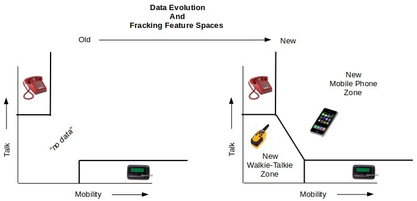
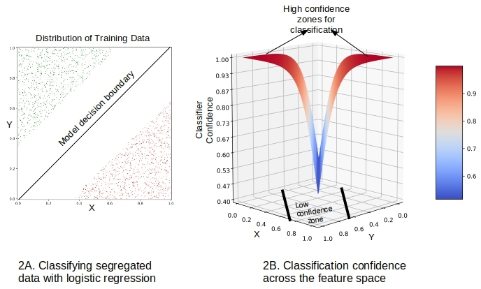
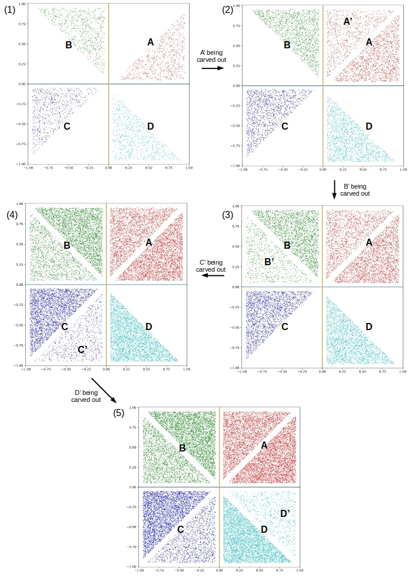
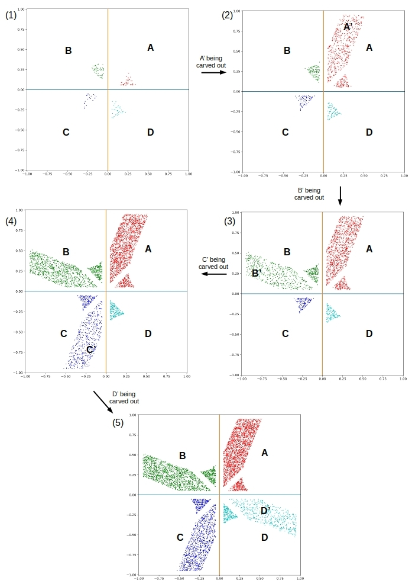
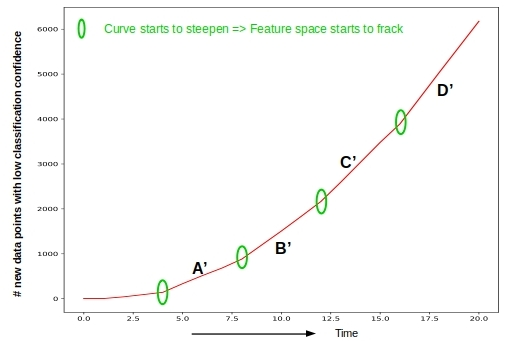

# Fracking Features in Machine Learning

This is the source code to go along with the blog article

[Fracking Features in Machine Learning](http://xplordat.com/2019/04/25/concept-drift-and-model-decay-in-machine-learning/)

When heretofore unseen data arrives at a model it carves out new zones of data in the same feature space. It may be benefecial to detect this and assign a new classes for the same. This is what we are referring here facetiously as the 'fracking' of the feature space.

An example of fracking features would look like the arrival of walkie-talkies and mobile phones in the space of talk/mobile.

A fracking indicator based on the new data points with low classification confidence is a clue to detecting the arrival of data into previously unpopulated zones.

## Dependencies

	numpy
	scikit-learn
	matplotlib

# Usage

The following will simulate data evolution in a 2-feature (x & y), 4-class situation where the training data is such that there are gaps in the feature space. The arrival of new data into these previously empty zones is detectable by keeping track of the new data with low classification confidence. Run the simulation with:

	pipenv run python ./fracking.py 250 4

where the initial training data consists of 250 points each in the 4 data zones. The run will generate pictures such as the one below that shows the steady fillout of previously empty zones.

And this that shows the distribution of data with low classification confidence:

The spurts in the rate of increase in the number of data points with low classification confidence is an indicator of fracking feature spaces.

